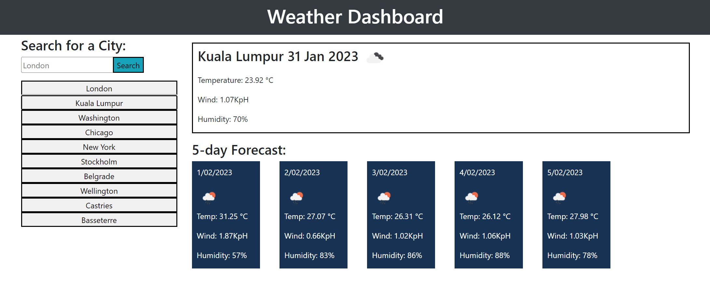

# Weather Dashboard

## Description

This week's challenge was to create a weather dashboard. The dashboard should allow you to search for the current weather and 5-day forecast of any city.

Visit the deployed page [here](https://yaszmoon.github.io/FEWDB-week08-Weather-Dashboard/).

## User Story

**AS A** traveler
**I WANT** to see the weather outlook for multiple cities
**SO THAT** I can plan a trip accordingly

## Acceptance Criteria

- Create a weather dashboard with form inputs.

- When a user searches for a city they are presented with current and future conditions for that city and that city is added to the search history.

- When a user views the current weather conditions for that city they are presented with:

    - The city name

    - The date

    - An icon representation of weather conditions

    - The temperature

    - The humidity

    - The wind speed

- When a user views future weather conditions for that city they are presented with a 5-day forecast that displays:

    - The date

    - An icon representation of weather conditions

    - The temperature

    - The humidity

- When a user clicks on a city in the search history they are again presented with current and future conditions for that city.

## Limitations

It took some time for me to figure out the best way to add and retrieve the city history from local storage. I managed something and limited it to ten for usuability sake. I did not have enough time to figure out how to ensure that when the buttons were regenerated that they did so in the search order once the number of searches had gone over 10.

Had trouble styling the page. This will require further study.

## Visuals

